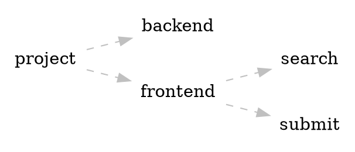
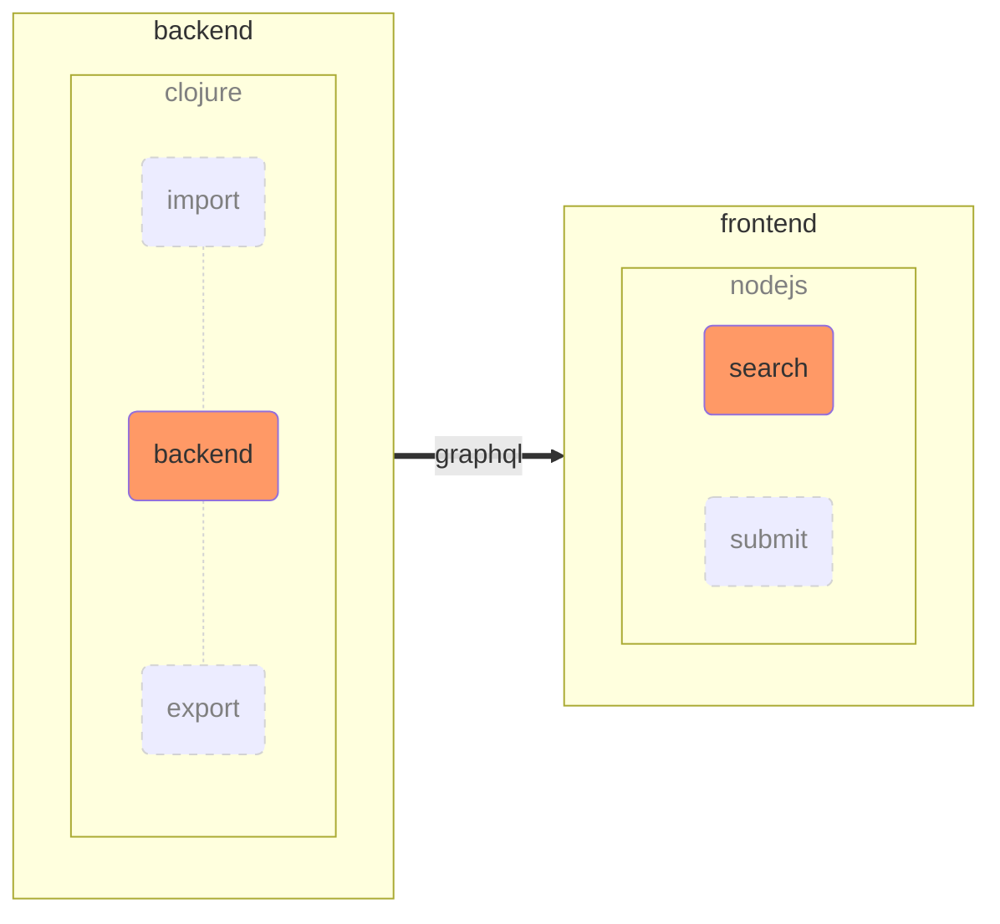
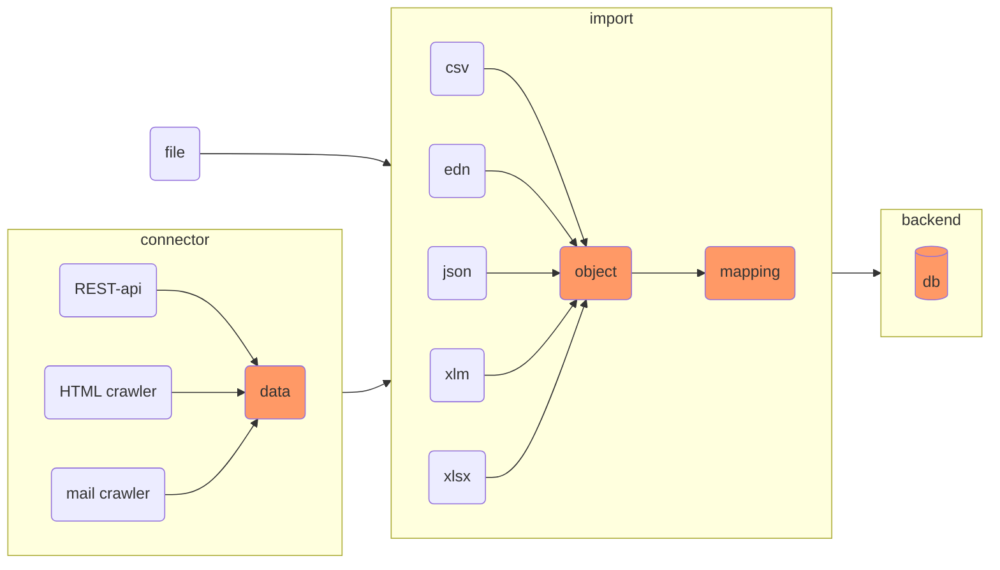

## Overview

as discribed the projects bases of backend and separated frontend. The file system structure represents this.

Whilst the backend runs on clojure the frontend is modeled in nodejs quering data unsing graphql-interface. 

The import and export function currently tied to the backend. Data to import will be pipelined from the source to interal database (rocksdb). Multiple steps allow imports to be adjusted. The connector gathers data from source (APIs, crawling for HTML/Mail) or supplied files. 

Delivered formats are loaded into objects. In general we expect 2 dimensional data. **First step - Reading** A file contains multiple rows. Each row is a data point. Each row has multiple values. Imports as CSV support headlines. **Second step - Mapping** The internal 2-dimensional data grid is mapped with help of associative attribut naming. Further rules, checks and specialised functions are added - see 'offer_mapping'. This allows to handle customer specific representation of boolean values or time string.

