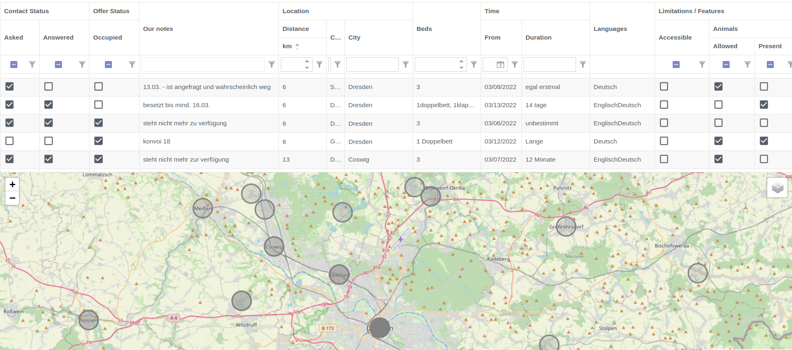

# Accommodation Software

**Contact:** <internet-for-refugees@lists.c3d2.de>

## Login and authentication

The authentication/login is two-step process, first you will be asked for your organisation login.

After that you will see a minimal dialogue asking you for your user-specific login credentials.

### Navigation of the UI

- **Structure:** On the lower half of the interface is a map, where the locations of the flats are displayed.
- **Table too small:** There is a handle at the edge between the map and the table, allowing to resize the division of space used for the table and the map.

- **Navigating through the table** After clicking into the table, it can be moved by using the cursor (arrow) keys.

<!--

It becomes that the flat is in the respective grey circle. For exact locations, the centre of the circle is the location.
-->

### Search and sort

- In principle, the header of each column is interactive. Search criteria can be compiled by writing in the columns header.
  The search results are then displayed directly in the table below.

- **Search:** The table can be filtered by most columns. To do this, simply type in the line between the table header and the first line with offers. With the filter symbol that is in this line in
  for example "contains the entered text" or "columns that should be displayed must have a value that is at least as large as the entered value". For most columns we already have a reasonable preselection.
- **Column types:** The table header contains input fields that can be used to search. The format of the column header depends on the column. Possible formats are e.g. strings, integers, checkboxes or dates. If a column has an incorrect type, please let us know.

- **Customise filter:** The filter method for a column header is in most cases equality or contains. However, this can also be changed by using the funnel icon (see image).

- **Reset filter/search:** F5 reloads the page and resets all filters.
- **Sort table** The table can be sorted by any column. Simply click on the column heading, e.g. "Beds" or "km". Clicking on it again reverses the sorting order. The third click cancels the sorting.

### Using the map

- In the table there is the column Distance, this distance is calculated from the current map centre to the respective flat.
- If you are looking for places in the centre of Dresden, for example, you align your map so that it points to the centre and then sort the entries in the table according to distance in descending order.

### Error / Bugs found.

- Please send us an email with a short description of how this error occurred. With instructions on how to reproduce this error. Screenshots are usually also very helpful, as well as potentially your browser + version.
